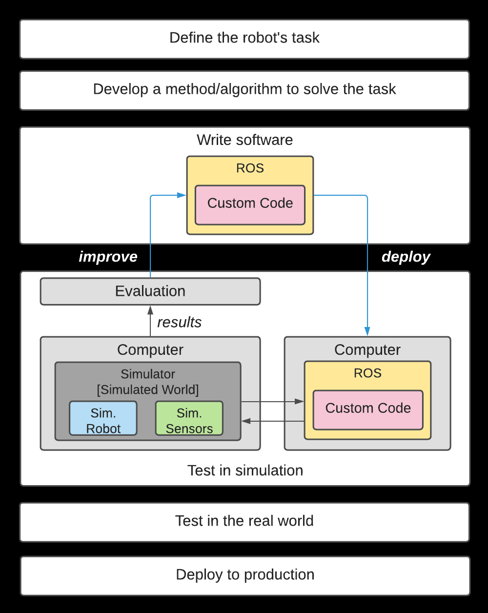
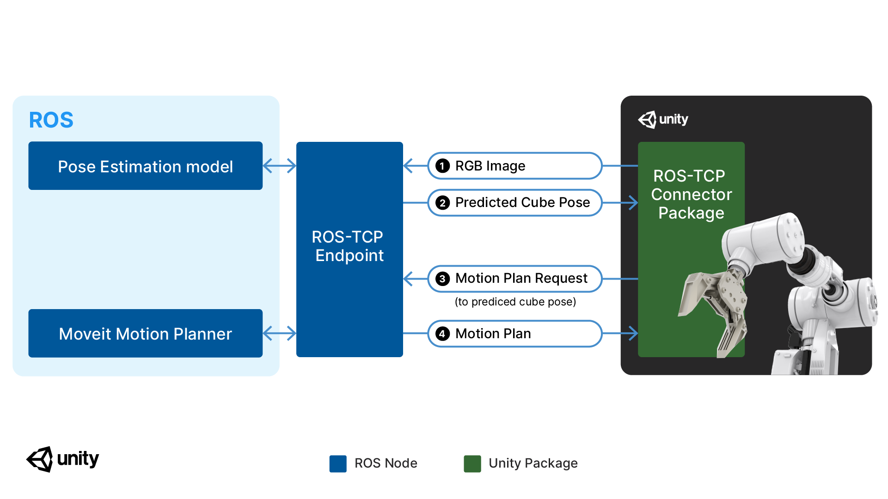
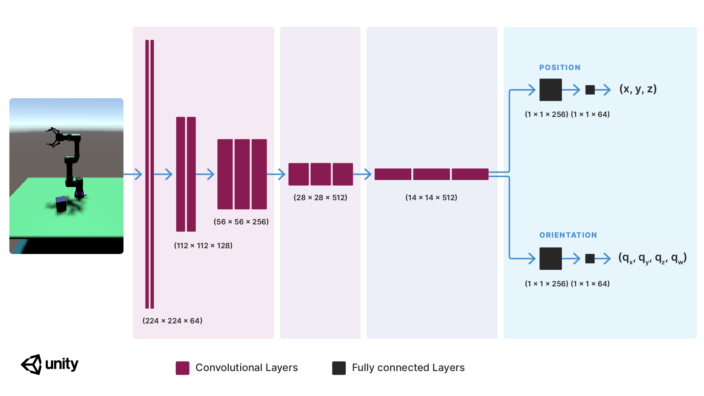
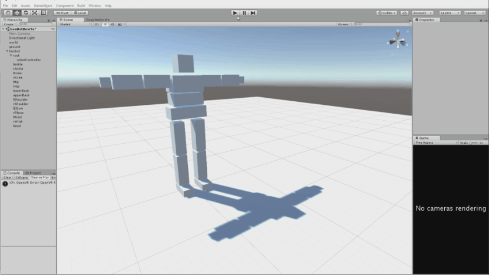
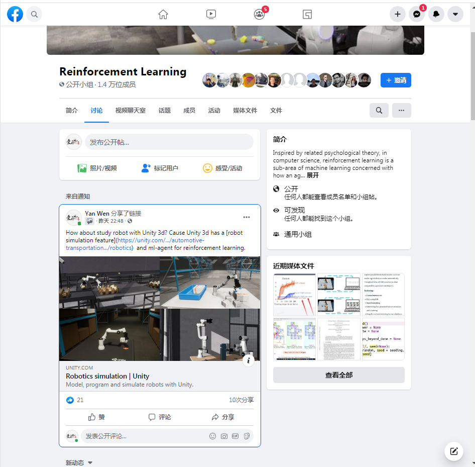
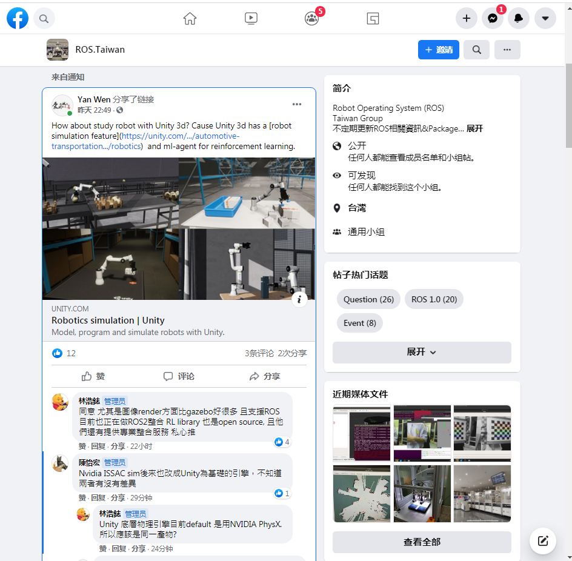
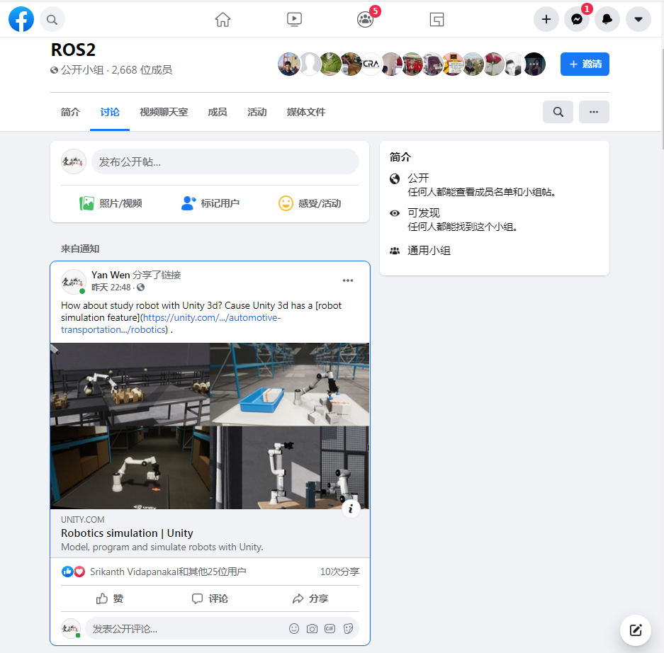

unity的官方GitHub，[unity-robotics-hub](https://github.com/Unity-Technologies/Unity-Robotics-Hub)，提供的视频中可以看出，unity中机器人的整体渲染效果很好，与已有的机器人仿真软件不相上下。而且官方提供了与ROS的接口，在社区中找到资料说不仅支持ROS2，还支持ROS1。

---

[Robotics-Object-Pose-Estimation](https://github.com/Unity-Technologies/Robotics-Object-Pose-Estimation)，这个项目是一个完整的tutorial，讲述了使用unity从机器人模型到使用深度学习训练机器人估计物体的位置。

---

[articulations-robot-demo](https://github.com/Unity-Technologies/articulations-robot-demo)，这个项目是unity提供的关于UR3机械臂、robotiq夹爪的教程，看起来效果蛮好的。

---

同时，unity还提供了很多blogs关于机器人。

- [**New!**] (March 2, 2021) Teaching robots to see with Unity [blog post](https://blogs.unity3d.com/2021/03/02/teaching-robots-to-see-with-unity/)
- (November 19, 2020) Robotics simulation in Unity is as easy as 1, 2, 3! [blog post](https://blogs.unity3d.com/2020/11/19/robotics-simulation-in-unity-is-as-easy-as-1-2-3/)
- (November 12, 2020) Unite Now 2020: Simulating Robots with ROS and Unity [video](https://resources.unity.com/unitenow/onlinesessions/simulating-robots-with-ros-and-unity)
- (August 26, 2020) Announcing Unity Robotic Simulation [blog post](https://unity.com/solutions/automotive-transportation-manufacturing/robotics)
- (May 20, 2020) Use articulation bodies to easily prototype industrial designs with realistic motion and behavior [blog post](https://blogs.unity3d.com/2020/05/20/use-articulation-bodies-to-easily-prototype-industrial-designs-with-realistic-motion-and-behavior/)

unity做机器人的缺点就是现在还不完善，正在开发中，包括Force/Torque sensor API 目前还没有，而其他机器人仿真器都已经有这个。unity相比机器人仿真器的优点是开源社区活跃且质量高，而且易于与微软和其他开源社区的比如机器学习、视觉等框架结合。

关于unity做机器人的官方说明，都可以在这个GitHub仓库中找到，[Unity-Technologies](https://github.com/Unity-Technologies)/**[Unity-Robotics-Hub](https://github.com/Unity-Technologies/Unity-Robotics-Hub)**

---

[Robotics simulation in Unity is as easy as 1, 2, 3!](https://blogs.unity3d.com/cn/2020/11/19/robotics-simulation-in-unity-is-as-easy-as-1-2-3/)，这篇文章提供了详细的开篇那个机器人的建模到控制的教程，包括与ROS的结合问题。

目前与ROS结合较好的仿真器只有gazebo，但是gazebo基于插件结构的编程方程很繁琐，而gazebo的上手难度是所有仿真器中最大的，pybullet虽然在仿真机器人方面较为简单，API非常易于使用，直接使用python编程驱动，这是pybullet的极大的优势，但是与ROS得结合几乎为0。 如果unity与ROS的结合较为好用的话，确是一个值得发展的方向。而且使用游戏建模工具来做机器人的场景，更容易做得很炫酷漂亮。

---

[Teaching robots to see with Unity](https://blogs.unity3d.com/cn/2021/03/02/teaching-robots-to-see-with-unity/)，这篇文章详细介绍了在unity中使用深度学习训练机械臂通过当前场景的视觉信息抓取物体。而且使用了ROS的运动规划器。

---

[How to Build Your Own Box Robot in Unity](https://blog.deepmotion.com/2018/04/05/how-to-build-your-own-box-robot-in-unity/)，这篇文章介绍了在unity中建模机器人的过程，

---

从Facebook group的反应来看，收到较多的赞且有一些转发，可能还是认可这一模式，而且两位台湾人给了一些使用方面的意见。PhysX物理引擎现在广泛用于游戏的动力学计算，且NVIDIA也主推这个引擎，与bullet引擎差别不是太大，mujuco是最好的刚体动力学引擎，但是收费很高。

